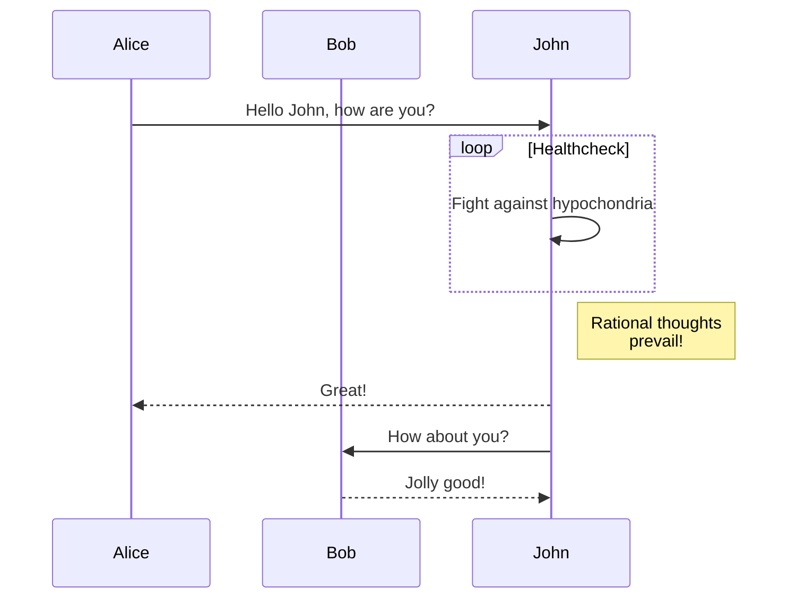

# 大文件上传
1. 分片上传
2. 异步计算md5

<iframe style="width: 100%; height: 800px" src="https://stackblitz.com/edit/stackblitz-starters-8mtows?embed=1&file=pages%2Findex.html"></iframe>

# 工具
命令行代理
```shell
export https_proxy=http://192.168.31.234:55555;export http_proxy=http://192.168.31.234:55555;export all_proxy=socks5://192.168.31.234:55555
```

```jsx
import ChildComponent from "./ChildComponent";
import Button from "./button";
import { useRef } from "react";

const ParentComponent = () => {
  const childRef = useRef();

  const callChildMethod = () => {
    if (childRef.current) {
      childRef.current.someMethod();
    }
  };

  const focusChildInput = () => {
    if (childRef.current) {
      childRef.current.focus();
    }
  };

  return (
    <div className="flex flex-col bg-slate-200">
      <div className="mt-4">
        <h1>parent component</h1>
        <Button onClick={callChildMethod}>Call Child Method</Button>
        <Button onClick={focusChildInput}>Focus Child Input</Button>
      </div>
      <ChildComponent ref={childRef} />
    </div>
  );
};

export default ParentComponent;
```

[知识点](docs/技术知识点/)

