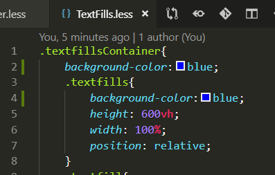
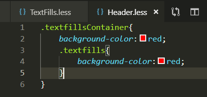
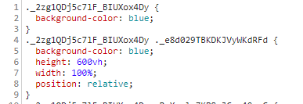
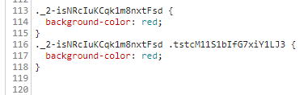

使用less和css module。在A和B两个less文件中分别写如下的样式。

```
.textfillsContainer{
  background-color:red;
  .textfills{
      background-color:red;
  }
}
```

A文件：


B文件：


在编译打包后的文件中观察：

A文件打包出来的css代码：


B文件打包出来的css代码：


可以看到，即使是相同的class名，由于less或者css module的作用，会视文件为一个模块，在打包时，根据模块对class名做混淆哈希。

所以只要不在一个文件（模块）中使用相同class名就能避免命名冲突。