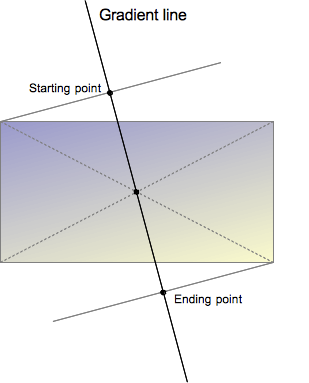

## 先说草图布局
现在工作的公司设计的页面似乎从来不考虑体验。比如说加载数据的loading界面，目前我发现B站、知乎等很多的APP、网页都在用下面图片这种效果。就是在没有拿到数据前，页面用条条框框的图形来代表内容和数据。

 

这个效果其实好像还没有一个正式的名字，“草图布局”这个名字是从[阮一峰的微博][http://weibo.ws/lJAtrc]看来的，我认为挺恰当的就这么叫吧。下图来自他的微博，微博里还有demo可以参考。

这个demo的实现原始是，在`background-image`中使用各种`gradient`来画圆形、矩形，使用`background-size`控制各个图形的尺寸，主要是宽度。再使用`background-position`控制各个图形的位置来布局。这里就用到的渐变色，只不过用来画了非渐变的图形。
  
demo中有一个高亮的动画效果，是使用一个有旋转了100度的`linear-gradient`加一个位置动画的效果实现的。


我在我的项目中实现这个效果时遇到了问题——怎么确定这个渐变色的起始位置。比如下图这一条红线。


它的效果由这段代码实现的：
```css
background-image: linear-gradient(
	120deg, 
	transparent 308px, 
	red 323px ,
	transparent 338px
);
```
linear-gradient的第一个参数是角度，其他3个参数表示某个位置及颜色，位置之间就是渐变色。想要一个图中这样从右上角开始的斜线，其中的`308`、`323`、`338`是怎么算的呢？下面研究一下计算方式。

## 渐变色的方向与位置
计算方法是不大直观的，而且需要先了解几个概念：渐变线、起始点和终点。

[摘抄MDZ文档][https://developer.mozilla.org/zh-CN/docs/Web/CSS/linear-gradient]



渐变线
:	由包含渐变图形的容器的中心点和一个角度来定义的。渐变线上的颜色值是由不同的点来定义，包括起始点，终点，以及两者之间的可选的中间点（中间点可以有多个）

起始点
:	是渐变线上代表起始颜色值的点。起始点由渐变线和过容器顶点的垂直线之间的交叉点来定义。（垂直线跟渐变线在同一象限内）

终点
:	是渐变线上代表最终颜色值的点。终点也是由渐变线和从最近的顶点发出的垂直线之间的交叉点定义的，然而从起始点的对称点来定义终点是更容易理解的一种方式，因为终点是起点关于容器的中心点的反射点。

由这些概念可以知道渐变色是从起始点开始沿着渐变线的方向绘制，渐变色的交界会垂直与渐变线。也就是说我们想做的红线是垂直于渐变线的。那么我们看下图
    
已知红线与上边成60度角（自己定义的），所以渐变线应该是120deg，过点B做120deg渐变线的垂直线，相交于点C，点A点C的线段A的长度就是红色的起始位置，如果上边长度为375，由勾股定理可知线段A长度为309，所以红线的起始位置就是309px，（我的代码里取了308px没什么区别）  
由此可以写出上面的代码来实现红线。（其实就是顶点到红线的距离）  
所以当我们想实现一个有角度的渐变色的时候，就可以用类似的方法来计算颜色的起始位置。  

如果渐变方向是平行与上下边或者左右边，可以这样写：
```css
background-image: linear-gradient(to bottom,red 25px ,blue 0);
background-image: linear-gradient(to right, red 25px ,blue 0);
```

另外下面代码的效果是一样的。
```css
background-image: linear-gradient(red 25px ,blue 0);
background-image: linear-gradient(180deg, red 25px ,blue 0);
```

另外，第二个颜色后面的数值便是渐变结束的位置，如果小雨前面颜色的位置就不会有渐变效果，利用这点可以用来实现草图布局。

例子：
```css
body,html{
	height: 100%;
}
.empty:empty {
	margin: auto;
	width: 702px;
	height: 100%;
	
	background-image:
		linear-gradient(100deg, 
			transparent 600px, rgba(255, 255, 255, 0.5) 630px ,transparent 660px),
		linear-gradient( lightgray 150px, transparent 0 ),
		linear-gradient( lightgray 150px, transparent 0 ),
		linear-gradient( lightgray 30px, transparent 0 ),
		linear-gradient( lightgray 88px, transparent 0 );

	background-size:
		100% 100%, /* highlight */
		336px 150px,
		336px 150px,
		570px 30px,
		720px 88px;

	background-position:
		-700px 0,
		0 24px,
		387px 24px,
		0 230px,
		0 284px;
	
	background-repeat: no-repeat;

	animation: shine 2s infinite;
}

@keyframes shine {
	to {
		background-position:
			160px 0,
			0 24px,
			387px 24px,
			0 230px,
			0 284px;
	}
}
```
