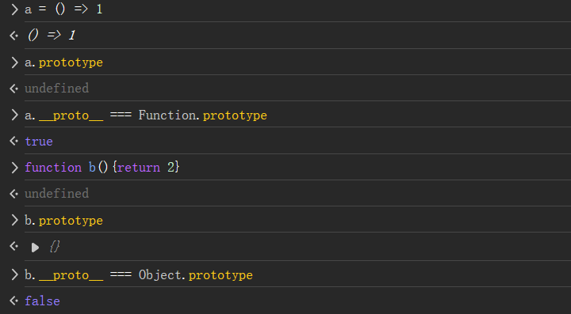

- 箭头函数没有独立的 [`this`](https://developer.mozilla.org/zh-CN/docs/Web/JavaScript/Reference/Operators/this)、[`arguments`](https://developer.mozilla.org/zh-CN/docs/Web/JavaScript/Reference/Functions/arguments) 和 [`super`](https://developer.mozilla.org/zh-CN/docs/Web/JavaScript/Reference/Operators/super) [绑定](https://developer.mozilla.org/zh-CN/docs/Glossary/Binding)，并且不可被用作[方法](https://developer.mozilla.org/zh-CN/docs/Glossary/Method)。
- 箭头函数不能用作[构造函数](https://developer.mozilla.org/zh-CN/docs/Glossary/Constructor)。使用 [`new`](https://developer.mozilla.org/zh-CN/docs/Web/JavaScript/Reference/Operators/new) 调用它们会引发 [`TypeError`](https://developer.mozilla.org/zh-CN/docs/Web/JavaScript/Reference/Global_Objects/TypeError)。
## 不能用作方法没有this

箭头函数表达式只能用于非方法函数，因为它们没有自己的 `this`。让我们看看将它们用作方法时会发生什么：
```js
const obj = {
  i: 10,
  b: () => console.log(this.i, this),
  c() {
    console.log(this.i, this);
  },
};

obj.b(); // 输出 undefined, Window { /* … */ }（或全局对象）
obj.c(); // 输出 10, Object { /* … */ }
```

由于类体具有 `this` 上下文，因此作为类字段的箭头函数会关闭类的 `this` 上下文，箭头函数体中的 `this` 将正确指向实例（对于[静态字段](https://developer.mozilla.org/zh-CN/docs/Web/JavaScript/Reference/Classes/static)来说是类本身）。但是，由于它是一个[闭包](https://developer.mozilla.org/zh-CN/docs/Web/JavaScript/Closures)，而不是函数本身的绑定，因此 `this` 的值不会根据执行上下文而改变。
```js
class C {
  a = 1;
  autoBoundMethod = () => {
    console.log(this.a);
  };
}

const c = new C();
c.autoBoundMethod(); // 1
const { autoBoundMethod } = c;
autoBoundMethod(); // 1
// 如果这是普通方法，此时应该是 undefined
```

这两个例子的区别是，对象字面量中的箭头函数方法没有绑定this，类字段的箭头函数有this上下文。

**call()、apply() 和 bind() 方法在箭头函数上调用时不起作用。**

- 因为箭头函数没有自己的 this 绑定，它们会捕获定义时所在的上下文中的 this 值，并在函数执行时使用这个值。
- 由于箭头函数的 this 是[[词法作用域]]绑定的，因此无法被他们修改。即使调了这几个方法，this也会被忽略，而使用原来的 this 值。

在回头看上面的两端代码，对象字面量的上下文是全局window，类字段的上线问是类实例。
## 不能用作构造器

箭头函数不能用作构造函数，当使用[[new操作符|new]]调用时会出错，因为他们没有prototype。

```js
const Foo = () => {};
const foo = new Foo(); // TypeError: Foo is not a constructor
console.log("prototype" in Foo); // false
```


没有prototype

