```mermaid
graph TD
    A[调用 new 操作符] --> B[创建一个新的空对象]
    B --> C[将新对象的 __proto__ 属性指向构造函数的 prototype 属性]
    C --> D[调用构造函数，将 this 绑定到新对象]
    D --> E{构造函数返回值是否为对象}
    E -->|是| F[返回构造函数返回的对象]
    E -->|否| G[返回新创建的对象]
```

```mermaid
flowchart TB
  y("👫 You") --> s{Subscribed to navendu.me?}
  s --> |Yes| a("🥳 You are awesome!")
  s --> |No| su[/"Subscribe to navendu.me"/] --> a
  click su href "/subscribe" _blank
```

# 基础数据类型

```goat
      .               .                .               .--- 1          .-- 1     / 1
     / \              |                |           .---+            .-+         +
    /   \         .---+---.         .--+--.        |   '--- 2      |   '-- 2   / \ 2
   +     +        |       |        |       |    ---+            ---+          +
  / \   / \     .-+-.   .-+-.     .+.     .+.      |   .--- 3      |   .-- 3   \ / 3
 /   \ /   \    |   |   |   |    |   |   |   |     '---+            '-+         +
 1   2 3   4    1   2   3   4    1   2   3   4         '--- 4          '-- 4     \ 4

```


  

```goat
+-----------------+
| Start           |
+-----------------+
        |
        v
+-----------------+
| Allocate Memory |
+-----------------+
        |
        v
+-------------------------+
| Call Constructor        |
| (Initialize Properties) |
+-------------------------+
        |
        v
+-----------------+
| Return Object  |
+-----------------+
        |
        v
+-----------------+
| End             |
+-----------------+


```